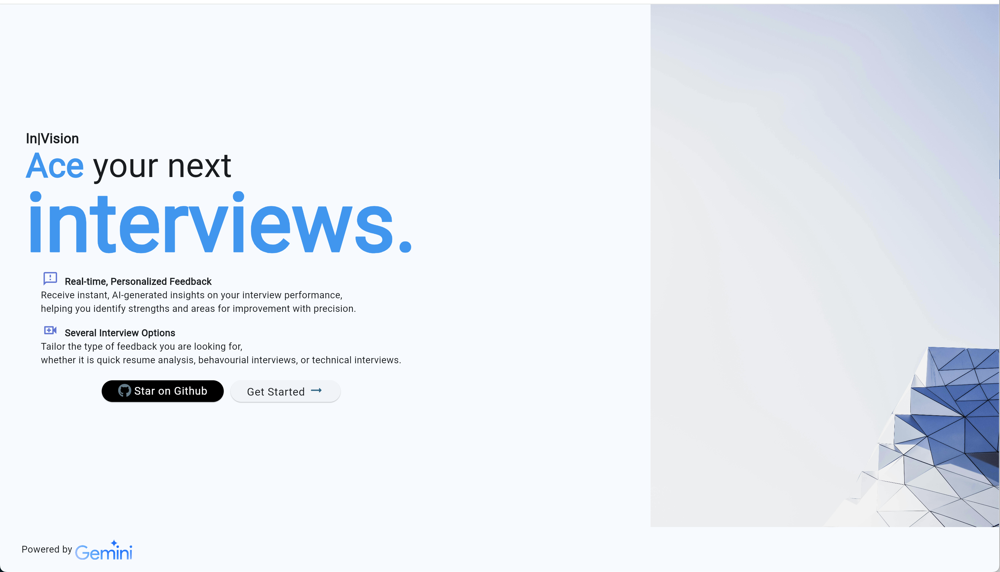
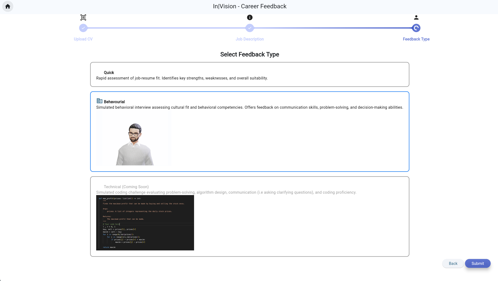

# InVision | Google Gemini API Competition 

## Demo 
For a short demo of the submitted version to the Google Gemini API Competition, check out the link below
https://www.youtube.com/watch?v=ZfETT-D4Fpc

### Landing Page

### Feedback / Assessment Selection

## Description

The app is a career feedback tool designed to enhance job preparation using AI capabilities. It provides user recommendations and feedback, and the application offers different types of feedback, including quick analysis and simulated mock interview.
The core landing page is built with Flutter. The backend is powered by a Python-based REST API. React is used to stream a custom avatar, created with Ready Player Me. The avatar interacts with users through Google's Text-to-Speech, creating a dynamic and engaging experience.

Gemini API plays a central role in the app by performing quick analyses of resumes and job descriptions provided by users. For the mock interview feature, I provided the application a curated set of questions and tips to ask the candidate, enhanced by prompt engineering, to deliver valuable feedback. The user is asked interview questions via the avatar, and upon completion. Thanks to the long context window, Gemini compiles an outline of feedback using all the previous information, including tailored recommendations and links to relevant courses for improvement.

## Local Development

For the application to run, it needs to be launched locally for the time being. 
You need to launch three things:  Flutter Frontend, Flask Backend, and React Frontend.

## To run the Python app
Libraries: 
- Conda

  
Install the libraries using 
- `conda env create -n CareerAITest2 -f environment.yml`
- `pip install flask flask_restful flask_cors pandas`
- `pip install google-generativeai google-api-python-client  firebase_admin pillow`
- `pip install .` from the root page
- In the terminal, `export GOOGLE_API_KEY=Your_API_Key` to use the Gemini Functionality

Go to the api.py file in src/API/ and 
run `python api.py` to run the Flask server.

## To run the Flutter application
>> Go to the Folder UI/flutter_app
`flutter run -d chrome`
or
`flutter run --profile -d chrome` for a faster User experience.

For the submission of a demo resume, feel free to use my resume at the root of this page.

## To run the Avatar App 
>> Go to the Folder ./UI/react

- `npm install`
- `export REACT_APP_TTS_KEY=Your_API_Key
- `npm run`

Credits: 
- Ready Player Me (Avatar) - Developer License for Commercial Use
- https://github.com/met4citizen/TalkingHead

